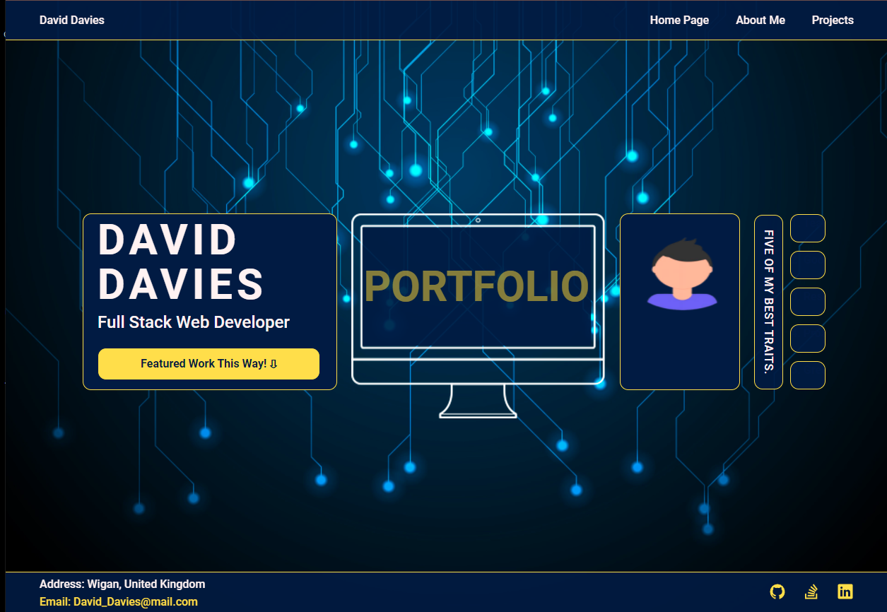
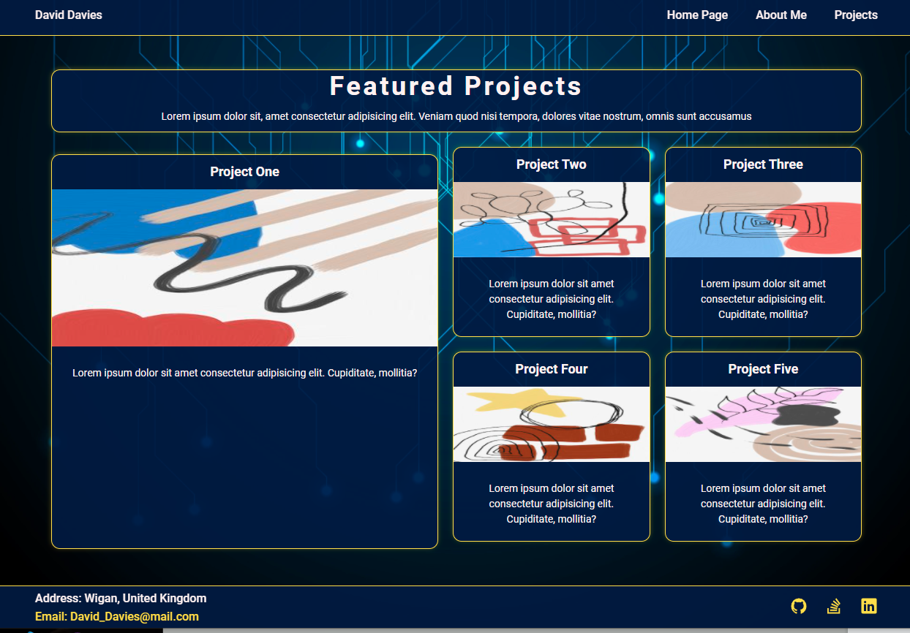
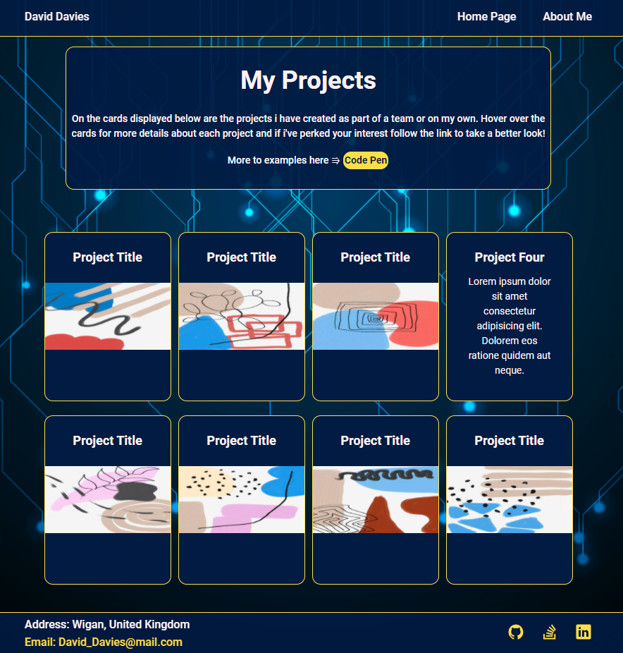
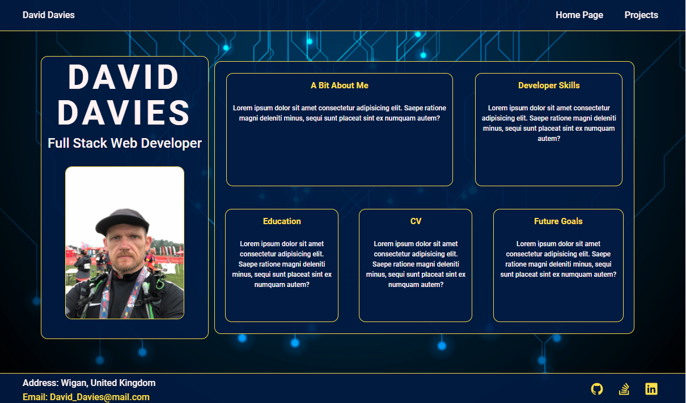
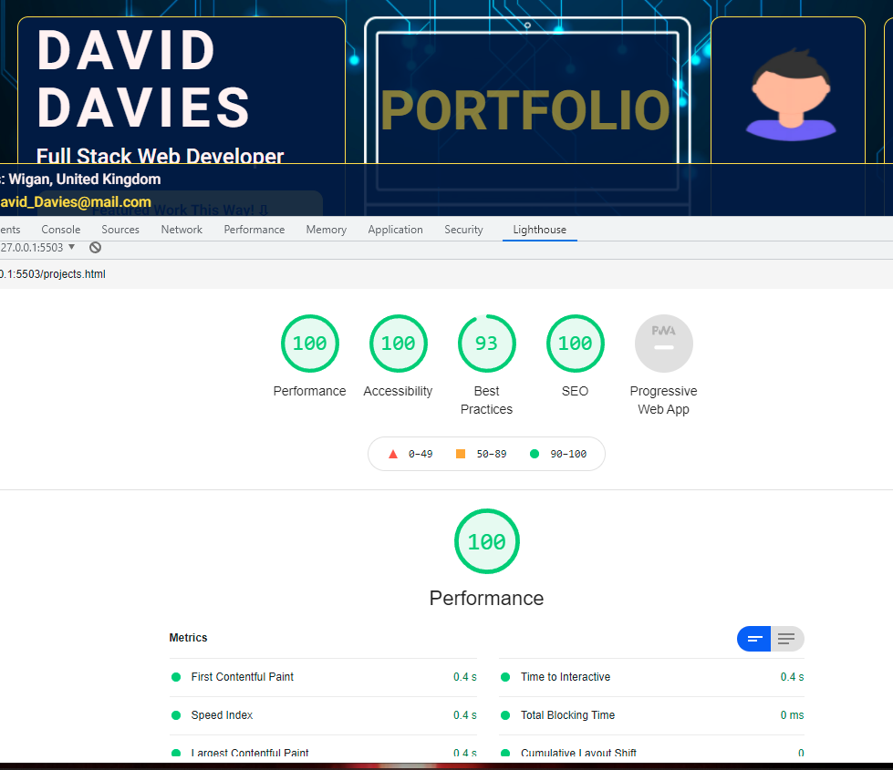

# ddportfolio

Name of Project
**DDportfolio**

[Click to view my Portfolio](https://daveydavey1901.github.io/ddportfolio/)

**Description**

This is my personnel porfolio.  The aim of this project is to create a portfolio that shows of by myself and my abilites as well as my completed and ongoing projects. In this version i have set out to do what i could with my current knowledge and give myself a foundation to improve from.

1. I have mainly just tried to create a layout with the required areas/pages with placeholder text and imgs. 
2. i've experemented with various types of grids and flexbox methods.
3. i've created and implemented some animations/transitions in the form or bars that ease out, cards with shadows and flip cards.
4. i've made use of links to each page as well as to other areas of pages.
5. the about me page has placeholders for me to add relevant data as i have produced it or will be filled out in the coming weeks.
6. i've ensured the code is semantic and accessible as possible as well as refactored it to shorten it and make it easier to read.
7. in the featured section the main project is larger than the others.
8. all cards have links on them that will take you to their respective projects when i have some projects to link too.
9. each page should resize from mobile to desktop using media queries.

**Visuals**

|Portfolio FrontPage |Feature Project Page|
|--------------------|--------------------|
|||

|Project Page |About Me Page|
|-------------|-------------|
|||

**Lighthouse Test on This Version**

|Lighthouse Image|
|----------------|
||

**Future Versions**

Some of the things i will be adding / changing / improving on in future versions are
1. start to fill all details in on all the pages where required including attaching an updated cv.
2. building some small projects to add to the projects cards as well as build some components for my CodePen Account.
3. adjust the cosmetics of the site overall as well as refactor and look to organise the code better.
4. add in some javascript components menus, page transitions.

as time goes on and as i gain in knowledge the portfolio will adapt and grow over the coming weeks and months.

## License

[MIT License](LICENSE)
